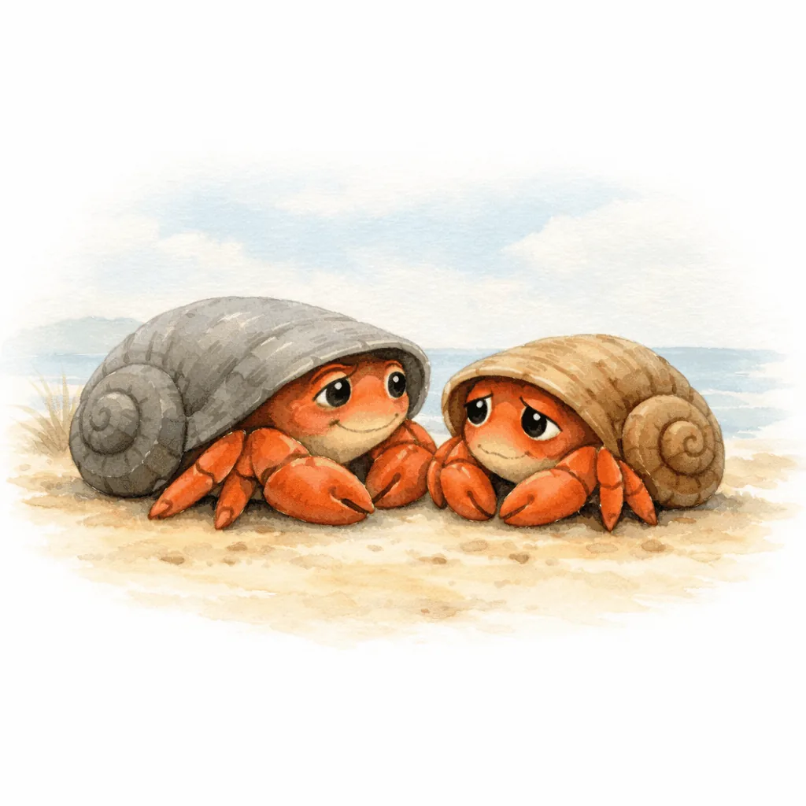
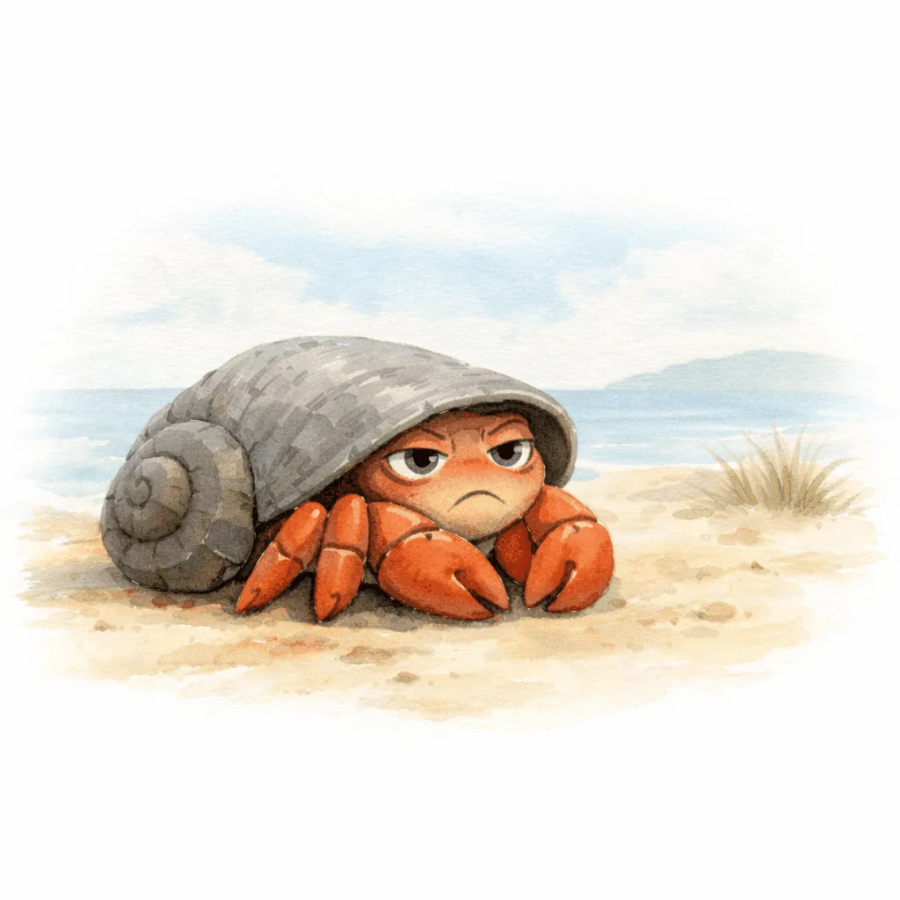
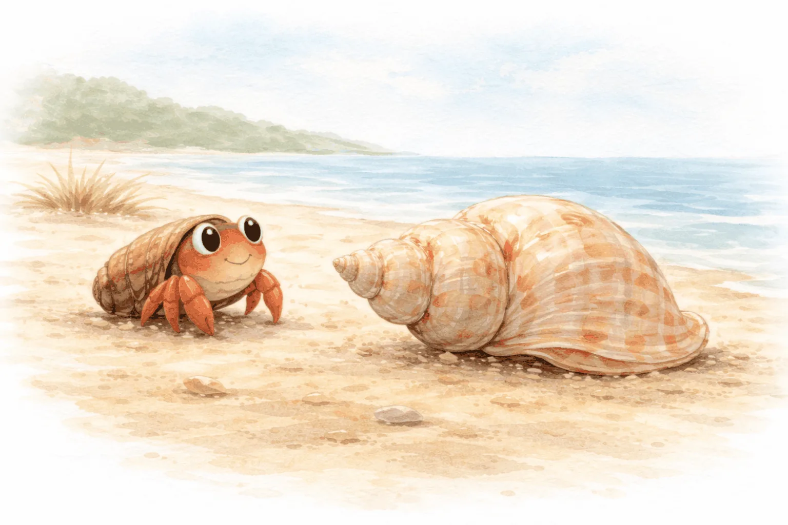
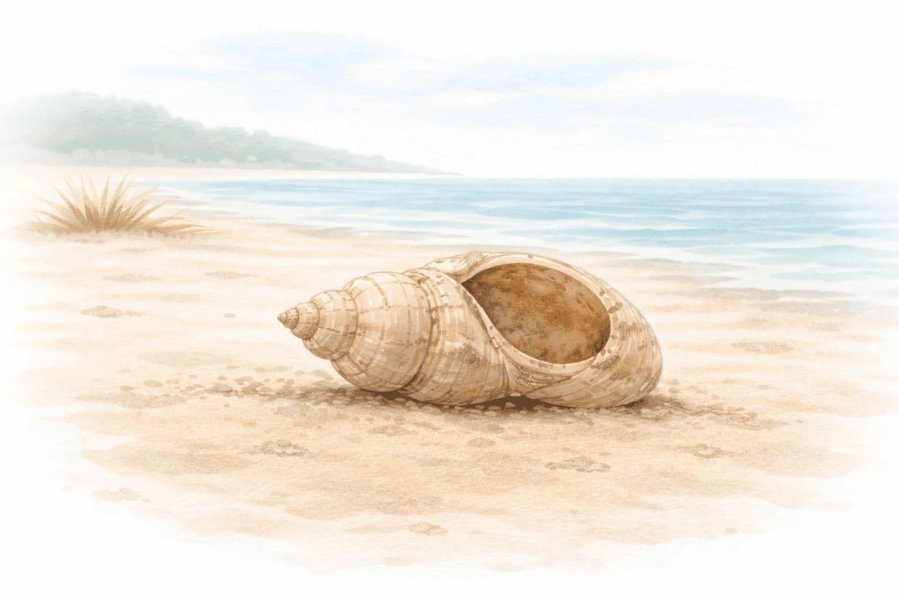
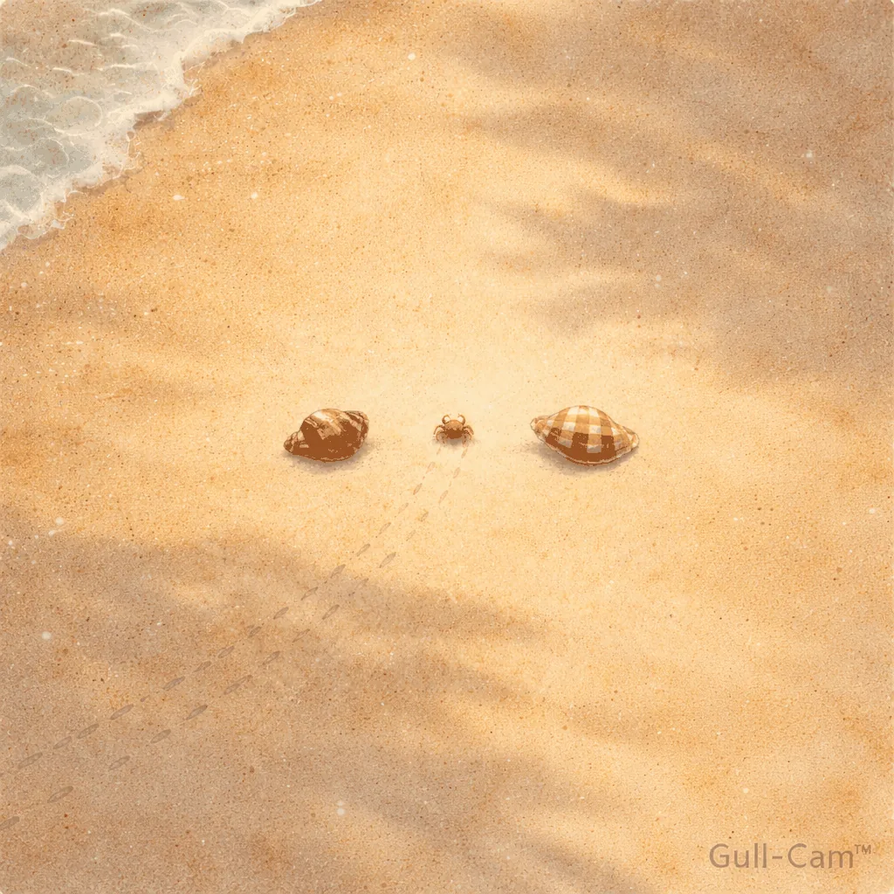
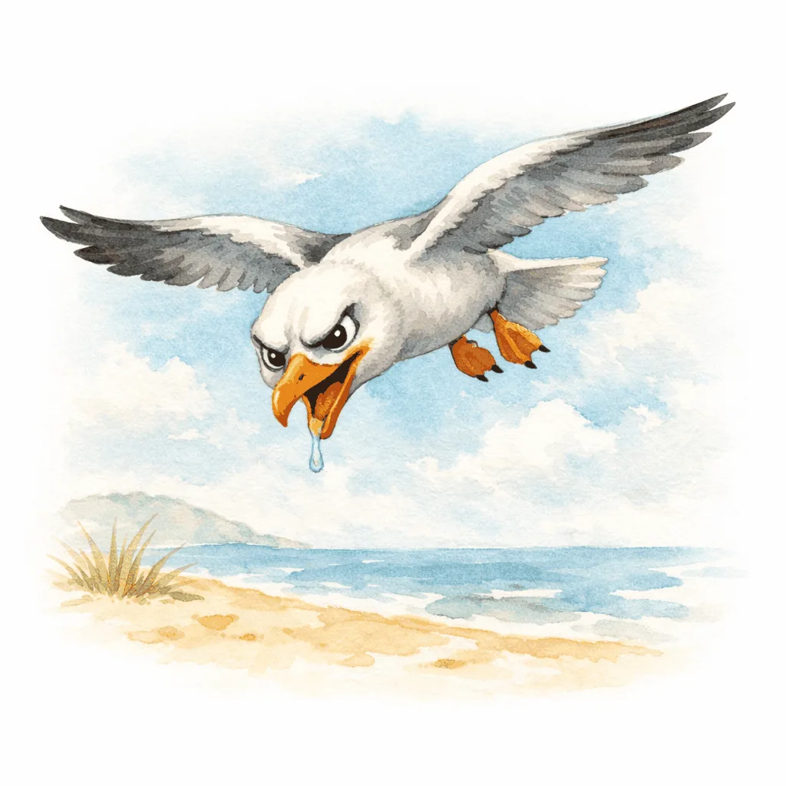
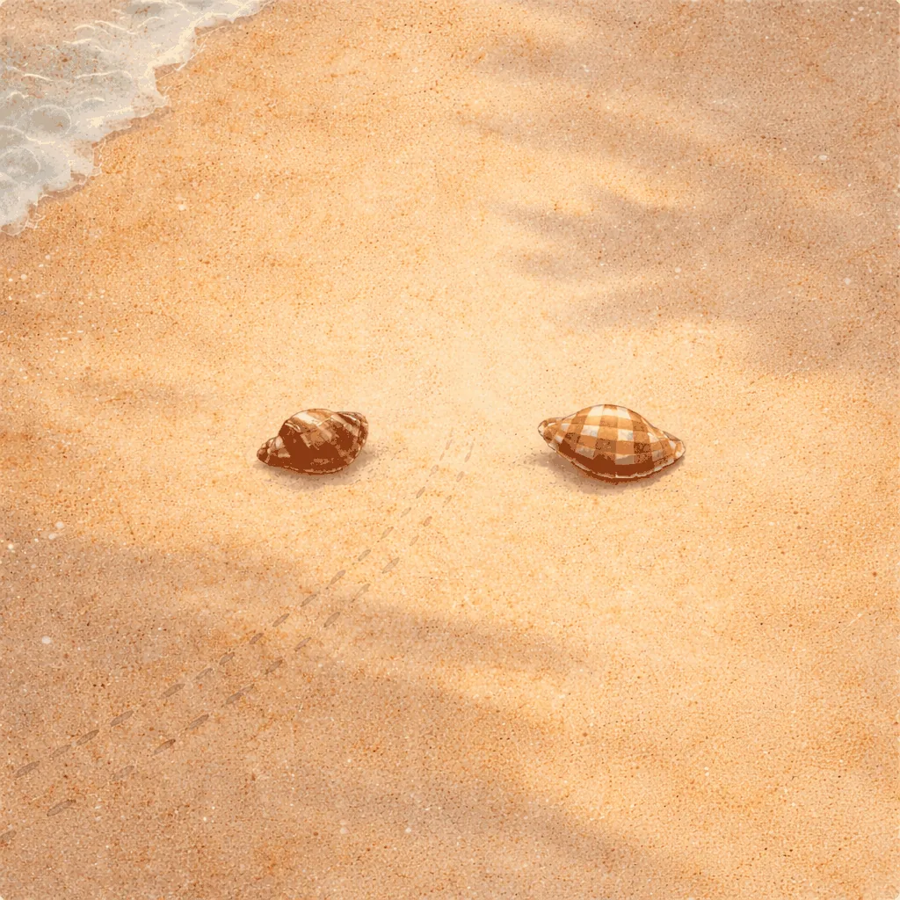
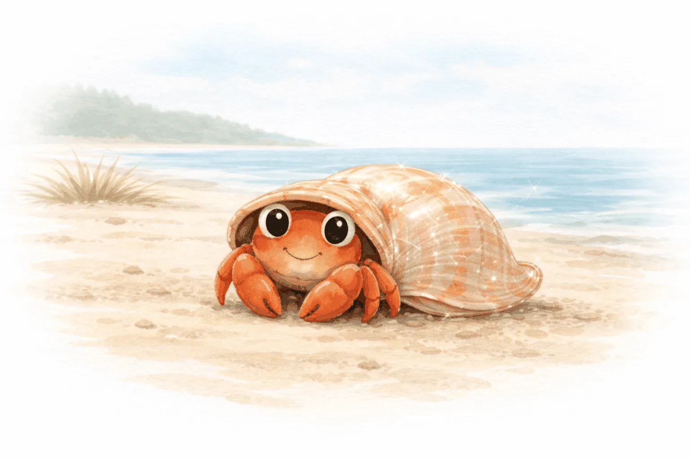
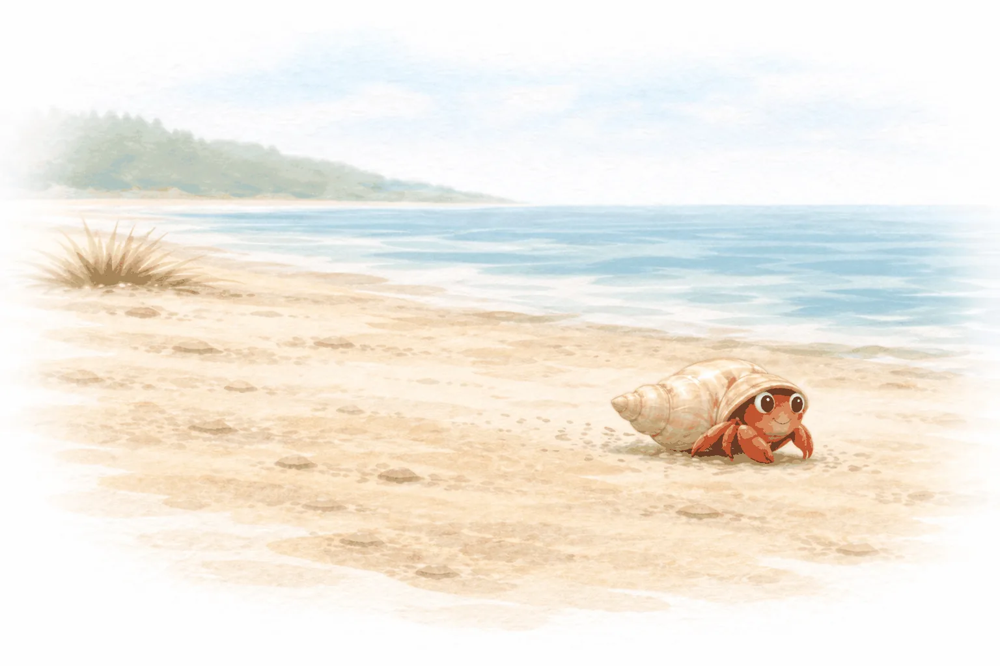
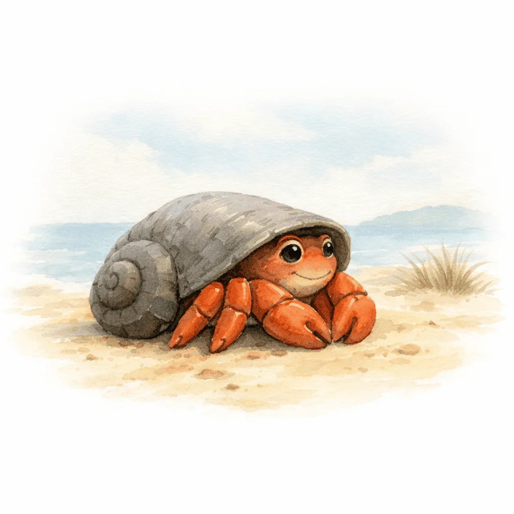

# Squished
### A Kids Book for Grown Ups
#### by Clarke Ching

---

## &nbsp;

	> "From a leader's viewpoint, creating the room for your people to grow into - that's priceless"
	> — Ali Law, IT Leader, Financial Services, United Kingdom

---

## &nbsp;

	Once upon a time, on a beach that smelled of salt and adventure, there lived a hermit crab named Harold.

	Harold loved his shell. It was small and brown and fit him perfectly. He could tuck himself inside and peek out at the world, safe and snug.

---

## &nbsp;

	"This," Harold would say to anyone who'd listen, "is the best shell on the whole beach."

	And for a while, it was.

---

## &nbsp;

	But Harold kept eating seaweed. And prawns. And whatever else hermit crabs eat when no one's looking.

	And one morning, Harold woke up feeling... *squished.*

---

## &nbsp;

	He tried to stretch. He couldn't.

	He tried to turn around. He couldn't do that either.

	"Hmm," said Harold. "The shell must have shrunk in the wash."

	*(It hadn't.)*

---

## &nbsp;

	His friend Mabel - an older hermit crab with a sensible grey shell - scuttled over.

	"Harold," she said, "you've gotten bigger."

	"Impossible. I'm exactly the same size I've always been. I'm just... *compressed.*"

---

## &nbsp;

	Mabel gave him The Look. You know the one.

	"You need a bigger shell," she said.

---

## &nbsp;

	"Leave my shell? This shell and I have been through everything together!"

	Harold shook his head. "And besides - a bigger shell would be heavier. I'd have to learn how to carry it all over again."

	"And yet," said Mabel, "you can't breathe."

---

## &nbsp;

	Harold had no answer for this.

---

## &nbsp;

	That evening, a young hermit crab named Edwin found Harold sulking behind a rock.

	"Why do you look so sad?" Edwin asked.

	"I'm not sad. I'm *squished.*"

---

## &nbsp;

	"What's squished?"

	Harold sighed. "It's when your shell used to fit perfectly, and now it doesn't, and you have to leave even though you don't want to."

	Edwin's eyes went wide. "That sounds terrible."

---

## &nbsp;

	"It is. But if you wait too long... you can't leave at all."

	"Does it happen to everyone?"

---

## &nbsp;

	Harold thought about this. "I suppose it does. If you're lucky enough to keep growing."

	Edwin looked at his own tiny shell - a little white spiral, barely bigger than a pebble. "I hope I get squished one day."

---

## &nbsp;

	Harold laughed. It was the first time he'd laughed all week.

	"Trust me," he said. "You will."

---

## &nbsp;

	Here's the thing about hermit crabs that Harold had somehow forgotten, even though he was one:

	Hermit crabs don't grow their own shells. They borrow them. They find empty shells left behind by other creatures, climb in, and call them home.

---

## &nbsp;

	And when they outgrow one shell, they have to find another.

	This is not optional. This is not a lifestyle choice. This is biology.

	But knowing something and doing something are two very different things.

---

## &nbsp;

	Actually, Harold hadn't really forgotten. He was avoiding it.

	Because leaving one shell and moving to the next is scary.

---

## &nbsp;

	That night, Harold couldn't sleep.

	He watched the moon rise over the ocean and thought about all the shells he'd had before.

---

## &nbsp;

	His first shell had been tiny. A little white spiral, barely bigger than a pebble - just like Edwin's. He'd loved that shell. But one day it got tight, and he'd left it behind.

	Then there was the speckled one. And the one with the chip in it. And the one that was slightly lopsided but had good ventilation.

---

## &nbsp;

	He'd left them all.

	And every single time, he'd felt squished first.

---

## &nbsp;

	And every single time, he'd been terrified.

	And every single time, he'd been fine.

	"Huh," said Harold.

---

## &nbsp;

	The next morning, Harold made a decision.

	He scuttled along the shoreline, looking. Searching.

---

## &nbsp;

	He passed a massive shell - gorgeous, speckled, nearly twice his size. For a moment, he imagined himself in it.

	His dream shell.

	But it was too big. Too heavy to carry. Too much space to fill. Maybe in a couple of crab-years. Not now.

---

## &nbsp;

	He passed another that was a little bigger than his current one - but older. A little beat up. A little tired. He filed that away.

	But then he saw another one.

	He circled it. Inspected it. Peered inside.

---

## &nbsp;

	It had a rather fetching spiral pattern. Streamlined. Aerodynamic. And it was just sitting there, empty, waiting.

	Was this his next shell?

---

## &nbsp;

	It looked good. It looked right.

	Harold positioned his old shell right next to the new one. Close as he could get.

	One quick move. That's all it would take.

---

## &nbsp;

	But that move meant being naked. Soft. Exposed. Even just for a moment.

	"Right," said Harold. "Here we go."

---

## &nbsp;

	Then he stopped. Still inside his old shell.

	His old shell had things in it. His little pile of sand, arranged just so. His worn-smooth corner where he liked to sleep. His piece of gold sea glass - tumbled smooth by the ocean and perfect for leaning against.

	Crab-years of careful arrangement.

---

## &nbsp;

	He couldn't just leave it all.

	Could he?

---

## &nbsp;

	Harold looked across at the new shell. Then back at his old stuff. He imagined carrying it all across - every grain, every pebble, every familiar scrap. Piling it into the new shell.

	But the new shell was a different shape. The corners were in different places. His old pile of sand wouldn't fit the same way. His worn-smooth corner wouldn't exist.

---

## &nbsp;

	And the new shell was bigger. Heavier. He'd have to learn how to carry it. Did he really want to weigh it down with all his old stuff too?

	Harold grabbed his sea glass and one clawful of sand - just the good stuff, just the bits he really wanted - and wiggled out of his old shell.

---

## &nbsp;

	Naked. Soft. Ridiculous.

	He dashed across to the new one. But at the entrance, he stopped. Looked back at what was left in his old shell. Did he really need it? Did he really want it?

	A seagull squawked overhead.

	Harold didn't think. He threw himself inside.

---

## &nbsp;

	Heart pounding.

	He looked back at his old shell, sitting there on the sand with most of his stuff still in it.

	Too late now.

---

## &nbsp;

	He looked around.

	Strange.

	The walls were in different places. The curves were unfamiliar. He didn't know which way to lean when the waves came.

---

## &nbsp;

	But he could breathe.

	He could stretch.

	And the sea glass? It fit nicely in a new corner. A different corner. *His* corner.

	There was space - so much space - for things he hadn't even thought of yet.

---

## &nbsp;

	"Okay," Harold admitted. "Maybe this is actually... better."

---

## &nbsp;

	A few weeks later, Harold was scuttling along the shoreline when something caught his eye. A glimmer. Green, tumbled smooth. Sea glass.

	He went to investigate.

	He'd been doing more of that lately. Coming out of his shell. Exploring. Looking for new things to put in new corners.

---

## &nbsp;

	He scuttled past a patch of sea grass, swaying in the current. Harold had heard rumours there was another type of grass, up on the land somewhere. He didn't believe it.

	And that's when he came across something remarkable.

---

## &nbsp;

	A queue of hermit crabs. Lined up from biggest to smallest. All waiting beside a row of empty shells.

---

## &nbsp;

	The biggest crab climbed into the biggest shell - a gorgeous spotted thing, nearly the size of a coconut.

	Then the second-biggest crab climbed into the shell the first one had just left.

	And the third crab climbed into the shell the second one had left.

	And so on, all the way down the line.

---

## &nbsp;

	One shell became available, and the whole community moved up together.

	Harold watched, transfixed.

---

## &nbsp;

	"Beautiful, isn't it?"

	Harold turned. Mabel had settled beside him.

	"I had no idea we did that," Harold said.

---

## &nbsp;

	"Most crabs don't. They think growth is a solo project. They don't realise - when you move to a bigger shell, you leave your old one behind. And someone smaller moves into it. And someone smaller moves into theirs."

---

## &nbsp;

	Harold thought about his old brown shell. He'd just... left it there. Empty. He hadn't thought about who might find it.

	"So when I grow..."

	"You make room for everyone behind you."

---

## &nbsp;

	Harold scanned the line of crabs. And there - at the very end - was a tiny crab with a familiar face.

	Edwin.

---

## &nbsp;

	The little crab was climbing into a shell Harold recognised. Small. Speckled. A little worn around the edges.

	One of his old shells. From crab-years ago. He'd thought he could never leave that one, either.

---

## &nbsp;

	Edwin poked his head out and looked around, delighted.

	Harold watched him explore the corners. Watched him find a spot he seemed to like.

	Then Edwin started rearranging things.

---

## &nbsp;

	Pushing sand around. Making it his own.

	Harold smiled.

---

## &nbsp;

	Mabel was still beside him.

	"You know," Harold said slowly, "I tried to bring all my stuff with me. When I changed shells. I was planning to ferry it all across, one clawful at a time."

	"What happened?"

	"A seagull."

---

## &nbsp;

	Mabel laughed.

	"I only brought what I could carry in one trip," Harold said. "My sea glass. A bit of sand. The stuff I really wanted."

	"And the rest?"

	"Left it behind."

---

## &nbsp;

	Mabel nodded. "We all make that mistake. You think you need to bring everything. But some things only belonged in that shell. That size. That version of you."

---

## &nbsp;

	"What do you bring, then?"

	"Only what you really need and really want. Leave the rest for whoever comes next."

	She gestured toward Edwin. "They won't keep it all anyway. They'll redecorate. Move things around. Make it theirs. Just like you're doing with your new shell."

---

## &nbsp;

	Harold looked down at himself. He'd barely noticed, but he had been redecorating. His sea glass in a new spot. New pile of sand in a different corner. New favourite spot to watch the sunset.

	The shell wasn't empty anymore.

	It was just... his.

---

## &nbsp;

	That night, Harold sat in his new shell - which didn't feel so new anymore - and thought about everything he'd learned.

---

## &nbsp;

	Growth is uncomfortable.

	It starts with feeling squished.

	And then comes that terrible, necessary, naked moment - when you're not who you were, and not yet who you're becoming.

---

## &nbsp;

	You cannot skip it.

	You cannot stuff your new shell with your old life.

	You have to leave some things behind - for whoever comes next.

---

## &nbsp;

	But here's the part they don't tell you:

	You've done this before.

	Every shell you've ever had, you once thought you couldn't leave.

	And every shell you've ever left, you can barely remember now.

---

## &nbsp;

	Some crabs never leave.

	They call it their comfort zone.

	But there's nothing comfortable about a shell that no longer fits.

	It's just familiar.

---

## &nbsp;

	Harold sat with that thought for a while.

	The moon rose over the ocean.

	The waves came in.

---

## &nbsp;

	Harold leaned into the curve of his shell - a new curve, one he was still learning - and watched the stars.

	He wasn't squished anymore.

	But he knew he would be again.

	And that would mean he was still growing.

---

# (Almost) THE END

---

# unsquish.me
### Share this story - it's free
